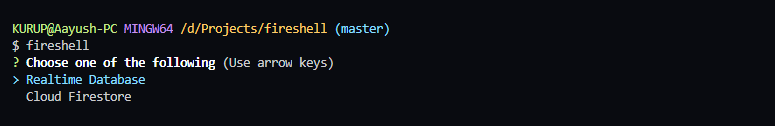
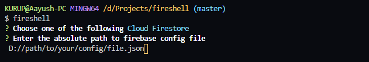
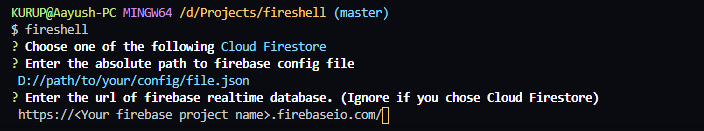

# Fireshell

**A shell for firebase realtime database and cloud firestore.**

Fireshell is a CLI tool which can be used to execute realtime database and cloud firestore queries in your terminal.


## Changelog v1.1.0

### Release Highlights

Added a setup for a config file which can be used to access the database directly without answering the prompts everytime user starts the shell.


## Installation

To install fireshell, simply pull up your terminal and run the following command :-

```
npm install -g fireshell
```

**NOTE:** You need to have Node.js and Node Package Manager installed in order to install fireshell.

## Usage

### Connecting the shell with the database


To start the shell, simply run `fireshell` in your terminal. You will be prompted a few questions.

First you'll have to choose the service you want to connect with :-



Then you have to provide the **absolute path** to your firebase config file. It has to be a JSON file that you get from firebase to connect your application with your firebase project.

**Important Note:-** Please make sure that the firebase config file has a key called "projectId". This key is very important in order to authenticate. If your config file has a key called "project_id", rename it to "projectId".



The last prompt will ask you to enter the reltime database url. If you chose firestore in the 1st prompt, then your can ignore this question. Otherwise, enter the url.



**Note:-** In versions >= 1.1.0 these prompts will be asked only once. After that, the shell will connect automatically using previously provided parameters.

### Writing Queries

Your queries must start with the keyword `db`. This `db` is a variable that stores reference to the database object. You can chain the rest of your query as you normally do.

For realtime database, make sure that you end any read query or any query that returns some data with the `once` method and pass `value` as its argument.

#### Examples of realtime database queries

```
// Create operation
> db.ref().child('user').set({name: "Iron Man", "alter-ego": "Tony Stark"})
```

<br />

```
// Read operation
> db.ref().child('user').once('value')
```

<br />

```
// Update operation
> db.ref().child('user').update({name: "Batman", "alter-ego": "Bruce Wayne"})
```

<br />

```
// Delete operation
> db.ref().child('user').remove()
```

#### Examples of cloud firestore queries

```
// Create operation
> db.collection('user').add({name: "Spiderman", "alter-ego": "Peter Parker"})
```

<br />

```
// Read operation
> db.collection('user').get()
```

<br />

```
// Update operation
> db.collection('user').doc('some-id').update({name: "Flash", "alter-ego": "Barry Allen"})
```

<br />

```
// Delete operation
> db.collection('user').doc('some-id').delete()
```

For more help, check out [Cloud Firestore](https://firebase.google.com/docs/firestore/) and [Realtime Database](https://firebase.google.com/docs/database/) docs.

# License

[MIT License](https://github.com/AayushK47/fireshell/blob/master/LICENSE) @ [Aayush Kurup](https://github.com/AayushK47)
